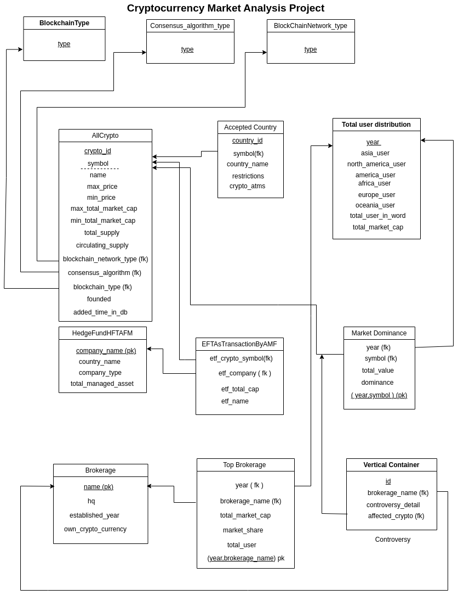

## 🚀  Cryptocurrency Market Analysis Using SQL
## 📚 Description: This project focuses on analyzing the cryptocurrency market using SQL. It covers various aspects like global adoption, blockchain type (like as: Public, Private, Hybrid, Consortium), blockchain network type (like as: Layer-1, Layer-2), consensus algorithm type (like as: PoS, PoW, PoC etc.), every year market cap, market dominance, transaction speeds, brokerage holdings, yearly returns, exchange traded fund, brokerage market dominance,controversy.

## 🛠️ Features
- Global Crypto Adoption Analysis
- Blockchain Type, Network Type, Consensus Algorithm Type
- Crypto Dominance Metrics
- Country-wise Crypto ATM Distribution
<!-- - Average Transaction Cost and Speed Analysis -->
- Yearly Returns Tracking
- Founding Year Analysis and Market Capitalization Study
- Exchange Traded Fund (ETF's).
- Brokerages’ Holdings Overview and Controversy

## ⚠️ Caution
> **Note:**  
> The data used in this project was collected from various public sources for educational and analytical purposes only.  
> It may not be 100% accurate, up-to-date, or suitable for financial decision-making.  
> Please verify information independently before using it in real-world applications.
> **We are not responsible or liable for any financial loss, damages, or consequences** arising from the use of this data, including but not limited to scams, misinterpretations, or inappropriate real-world applications.
> Users are strongly advised to independently verify any information before relying on it for financial, commercial, or personal decision-making.


## Schema Diagram:


## Sample Query:

<ol>
<li>

```sql
# Sort top 10 Cryptocurrency by ascending order depend on max price
select *
from AllCrypto order by max_price asc limit 10;
```


</li>

```sql
# # Sort top 10 Cryptocurrency by ascending order depend on max price except the 3 lowest max price
select * from AllCrypto order by max_price asc limit 10 offset 2;
```
<li>

<li>

```sql
# Query for only PoS currencies
select * from AllCrypto where consensus_algorithm='PoS'
```

</li>

<li>

```sql
# Market Growth And User Growth Of Every Year From 2009 To 2025

select T2.year,
       concat(T2.total_user,' million') as total_user,
       concat((((T2.total_user-T1.total_user)*100)/T1.total_user),'%') as user_growth,
       concat(T2.total_market_cap,' billion') as market_cap,
       concat((((T2.total_market_cap-T1.total_market_cap)*100)/T1.total_user),'%') as market_growth
from TotalUserDistribution as T1 join TotalUserDistribution as T2
where timediff(T2.year,T1.year)=1;
;
```

</li>

</li>
<ol>