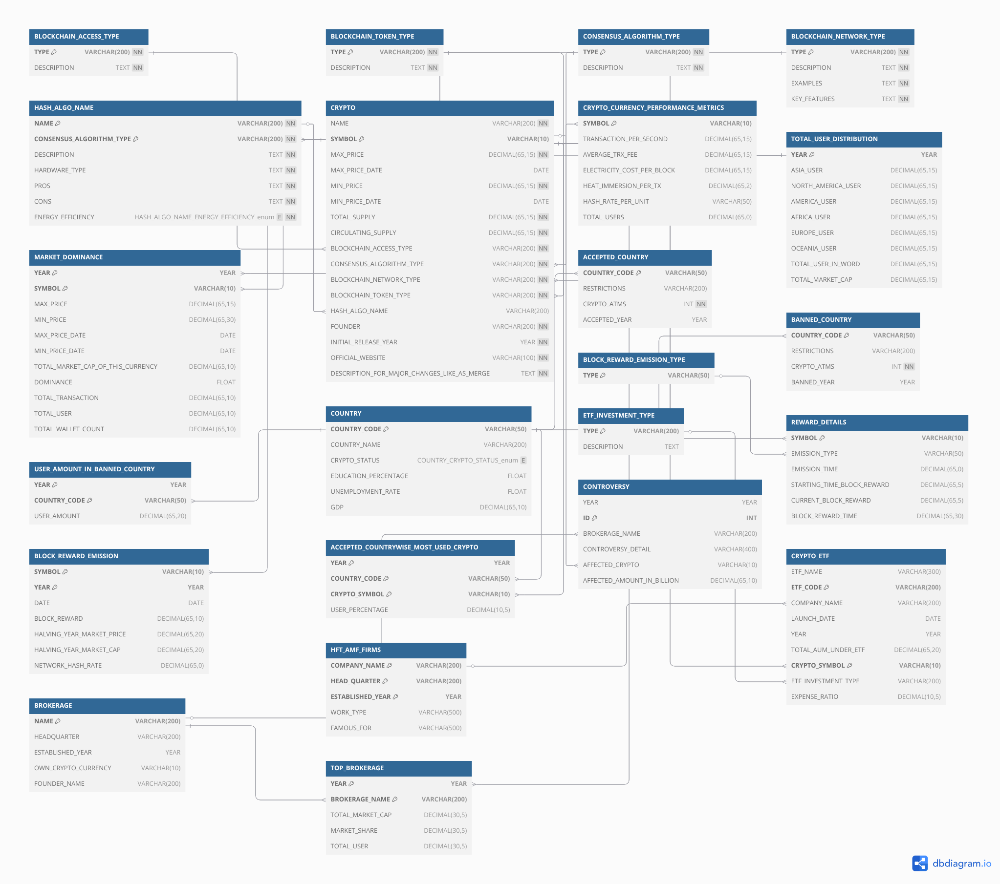

## 🚀  Cryptocurrency Yearly Market Analysis Project Using SQL

## License

> This project is licensed under the Apache License 2.0.  
> See the [LICENSE](./LICENSE) file for more details.

## 📚 Project Overview: This project analyzes the real-time impact of the cryptocurrency market on global and national levels. This project is based on yearly data. It explores how crypto mining, ETFs, new investors and traders, and decentralized finance influence employment, the environment, and the economy. The study highlights both positive outcomes, such as job creation, financial inclusion, and innovation, and negative effects, such as energy consumption, financial risk, and regulatory challenges. Real-world examples include the USA, Canada, and El Salvador's adoption of Bitcoin, the rise of crypto-based freelancing, and increased global investment through crypto ETFs. It has also become a new financial weapon for some countries, as they use crypto for their strategic reserves. This project serves as a foundational tool for the crypto industry, bridging technical, financial, and regulatory domains to foster innovation, compliance, and market efficiency in real-time scenarios.

## Legal & Ethical Considerations  
### **Disclaimer**  
This project and its associated data are intended for **educational and analytical purposes only**. The information provided does not constitute financial, investment, or legal advice. Cryptocurrency markets are highly volatile and speculative.  

- **No Liability**: **The authors, contributors, and affiliated institutions shall not be held liable for any financial losses, damages, or decisions made based on the data, analysis, or conclusions presented in this project**.  
- **Accuracy**: **While efforts have been made to ensure data accuracy, cryptocurrency markets are dynamic and subject to rapid change. Always verify data with primary sources**.  
- **Risk Acknowledgement**: **Users assume all risks associated with cryptocurrency investments. Consult a licensed financial advisor before making investment decisions**.  

## Tools & Data Sources 
- `Database Engines`: `MySQL`, `MSSQL`
- `Design Tools`: `DB Diagram`, `DataGrip`
- `IDE`: `DataGrip`, `SSMS`

## Entity Relationship Diagram: 

## Schema Diagram:
