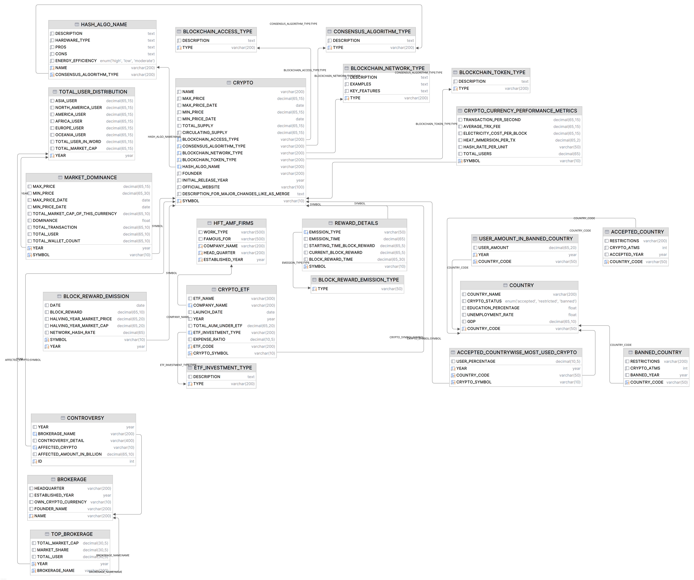
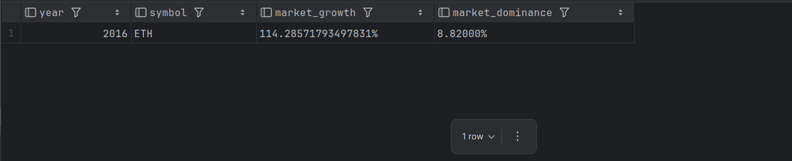
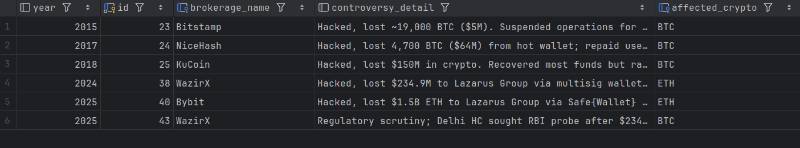
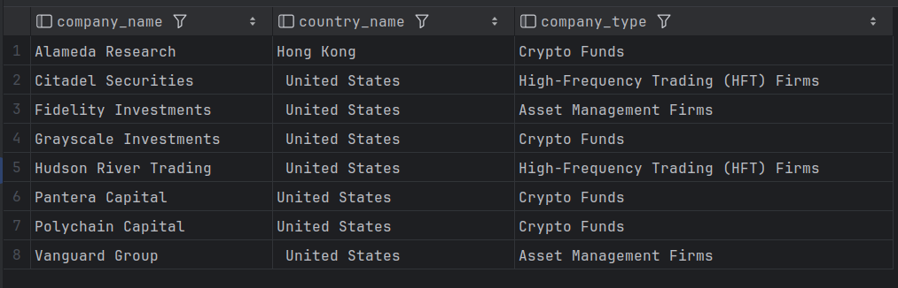
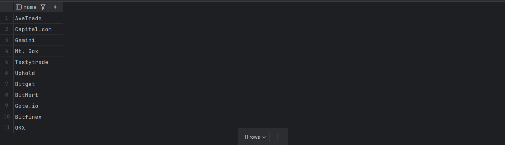
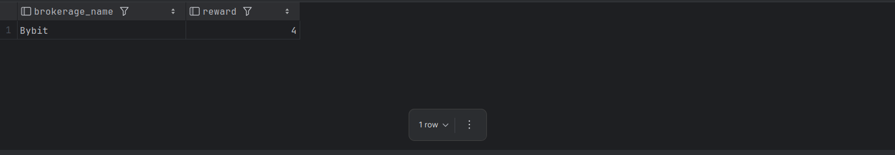

## 🚀  Cryptocurrency Market Analysis Using SQL
## 📚 Description: This project focuses on analyzing the cryptocurrency market using SQL. It covers various aspects like global adoption, blockchain type (like as: Public, Private, Hybrid, Consortium), blockchain network type (like as: Layer-1, Layer-2), consensus algorithm type (like as: PoS, PoW, PoC etc.), every year market cap, market dominance, transaction speeds, brokerage holdings, yearly returns, exchange traded fund, brokerage market dominance,controversy.

## 🛠️ Features
- Global Crypto Adoption Analysis
- Blockchain Type, Network Type, Consensus Algorithm Type
- Crypto Dominance Metrics
- Country-wise Crypto ATM Distribution
- Average Transaction Cost and Speed Analysis
- Yearly Returns Tracking
- Founding Year Analysis and Market Capitalization Study
- Exchange Traded Fund (ETF's).
- Brokerages’ Holdings Overview and Controversy

## ⚠️ Caution
> **Note:**  
> The data used in this project was collected from various public sources for educational and analytical purposes only.  
> It may not be 100% accurate, up-to-date, or suitable for financial decision-making.  
> Please verify information independently before using it in real-world applications.
> **We are not responsible or liable for any financial loss, damages, or consequences** arising from the use of this data, including but not limited to scams, misinterpretations, or inappropriate real-world applications.
> Users are strongly advised to independently verify any information before relying on it for financial, commercial, or personal decision-making.


## Schema Diagram:


## Sample Query:

<ol>

<li>

```sql
# Sort top 10 Cryptocurrency by ascending order depend on max price
select *
from AllCrypto order by max_price asc limit 10;
```


</li>

<li>

```sql
# # Sort top 10 Cryptocurrency by ascending order depend on max price except the 3 lowest max price
select * from AllCrypto order by max_price asc limit 10 offset 2;
```
</li>

<li>

```sql
# Query for only PoS currencies
select * from AllCrypto where consensus_algorithm='PoS'
```

</li>

<li>

```sql
# Market Growth And User Growth Of Every Year From 2009 To 2025

select T2.year,
       concat(T2.total_user,' million') as total_user,
       concat((((T2.total_user-T1.total_user)*100)/T1.total_user),'%') as user_growth,
       concat(T2.total_market_cap,' billion') as market_cap,
       concat((((T2.total_market_cap-T1.total_market_cap)*100)/T1.total_user),'%') as market_growth
from TotalUserDistribution as T1 join TotalUserDistribution as T2
where timediff(T2.year,T1.year)=1;
;
```

</li>

<li>

```sql
# query for only these currency which consensus algo is 'PoS'
select MarketDominance.year,MarketDominance.symbol,concat(MarketDominance.total_value,' billion'),concat(MarketDominance.dominance,'%') from MarketDominance join AllCrypto  where MarketDominance.symbol=AllCrypto.symbol
and AllCrypto.consensus_algorithm='PoS';
```

</li>


<li>

```sql
# query for only these currency which consensus algo is 'Layer-1'
select MarketDominance.year,MarketDominance.symbol,concat(MarketDominance.total_value,' billion'),concat(MarketDominance.dominance,'%') from MarketDominance join AllCrypto  where MarketDominance.symbol=AllCrypto.symbol
and AllCrypto.blockchain_network_type='Layer-1';
```

</li>

<li>

```sql

# which country has highest atm booth for 'AuxPoW' consensus algorithm.
select AcceptedCountry.country_name from AcceptedCountry join AllCrypto where AcceptedCountry.symbol=AllCrypto.symbol and AllCrypto.consensus_algorithm='AuxPoW';
```

</li>

<li>

```sql
# market growth of PoS (Ethereum), PoS from 2015 to 2016
with  tmp as (select MarketDominance.year,MarketDominance.symbol,MarketDominance.total_value
              ,MarketDominance.dominance
              from MarketDominance join AllCrypto where AllCrypto.consensus_algorithm like '%PoS%' and AllCrypto.symbol=MarketDominance.symbol)
select tmp1.year,tmp1.symbol,concat(((tmp1.total_value-tmp2.total_value)*100/tmp2.total_value),'%') as market_growth,concat(tmp1.dominance,'%') as market_dominance from tmp as tmp1 join tmp as tmp2 where  timediff(tmp1.year,tmp2.year)=1 and tmp1.year>=2015 and tmp1.year<=2016
and tmp2.year>=2015 and tmp2.year<=2016 order by tmp1.dominance desc ;
```



</li>

<li>

```sql
# controversies occur due to hacked
select * from Controversy where controversy_detail like '%hack%';
```



</li>


<li>

```sql
# query for those company who have not launch etf yet 

with tmp as (select * from HedgeFundHFTAFM as giant left join EFTAsTransactionByAMF EATBA on giant.company_name = EATBA.etf_company)
select tmp.company_name,tmp.country_name,tmp.company_type from tmp where tmp.etf_name is null;
```



</li>


<li>

```sql
# query for those broker who has no controversies

with tmp as (select * from Brokerage as br left join Controversy C on br.name = C.brokerage_name)
select tmp.name from tmp where tmp.affected_crypto is null;
```


</li>


<li>


```sql
# if a broker get 1 reward for 1 controversy which broker got 1s place
with tmp as (select brokerage_name,count(brokerage_name) as reward from Controversy group by brokerage_name)
select * from tmp order by reward desc limit 1;
```


</li>

<li>

```sql
# QUERY FOR THIS BROKERAGE WHOSE HEADQUARTER IN THIS KIND OF COUNTRY WHERE CRYPTO IS ACCEPTED
SELECT BROKERAGE.NAME,BROKERAGE.HEADQUARTER,COUNTRY.CRYPTO_STATUS FROM BROKERAGE JOIN COUNTRY WHERE COUNTRY.CRYPTO_STATUS='ACCEPTED' AND BROKERAGE.HEADQUARTER LIKE
                                                                                                     CONCAT('%',COUNTRY.COUNTRY_NAME,'%');
```

```
Output:
AvaTrade,"Dublin, Ireland",ACCEPTED
Binance,"George Town, Cayman Islands",ACCEPTED
Bitfinex,Hong Kong,ACCEPTED
Bitget,"Victoria, Seychelles",ACCEPTED
Bitstamp,"Luxembourg City, Luxembourg",ACCEPTED
Capital.com,"Limassol, Cyprus",ACCEPTED
Crypto.com,Singapore,ACCEPTED
eToro,"Tel Aviv, Israel",ACCEPTED
FTX,"Nassau, Bahamas",ACCEPTED
Gate.io,"George Town, Cayman Islands",ACCEPTED
KuCoin,"Victoria, Seychelles",ACCEPTED
Mt. Gox,"Shibuya, Tokyo, Japan",ACCEPTED
NiceHash,"Ljubljana, Slovenia",ACCEPTED
OKX,"Victoria, Seychelles",ACCEPTED

```       
</li>

<ol>


## Relationship:

>> BLOCKCHAIN_ACCESS_TYPE	CRYPTO	1:N

>> BLOCKCHAIN_TOKEN_TYPE	CRYPTO	1:N

>> CONSENSUS_ALGORITHM_TYPE	CRYPTO	1:N

>> BLOCKCHAIN_NETWORK_TYPE	CRYPTO	1:N

>> HASH_ALGO_NAME	CRYPTO	1:N

>> CRYPTO	CRYPTO_CURRENCY_PERFORMANCE_METRICS	1:1

>> TOTAL_USER_DISTRIBUTION	MARKET_DOMINANCE	1:N

>> CRYPTO	MARKET_DOMINANCE	1:N
